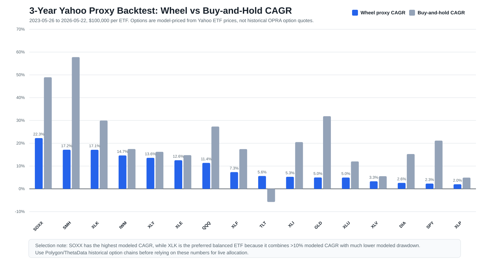
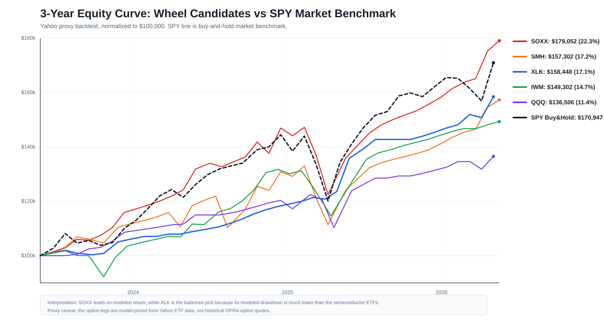

# Yahoo Finance Proxy 3-Year Backtest

Period: 2023-05-26 to 2026-05-22  
Initial capital: $100,000 per ETF  
Universe: SPY, QQQ, IWM, DIA, XLK, XLF, XLE, XLV, XLP, XLU, XLI, XLY, SMH, SOXX, TLT, GLD

Important: this is a Yahoo Finance proxy backtest. It uses real Yahoo ETF daily OHLCV data, but historical option chains are model-priced with Black-Scholes from historical volatility because Yahoo Finance does not provide complete historical option-chain quotes through the free chart endpoint.

## Return Comparison

## Selected ETF

The top proxy result is `SOXX`.

`SOXX` produced the highest Wheel proxy CAGR in the core ETF universe:

- End equity: $182,443.61
- CAGR: 22.28%
- Max drawdown: -16.84%
- Assignment rate: 14.81%
- Win rate: 58.97%
- Buy-and-hold CAGR: 48.96%

This is not the most conservative choice. For a more balanced result, `XLK` had similar proxy CAGR to `SMH` with much lower modeled drawdown:

- XLK CAGR: 17.14%
- XLK max drawdown: -1.62%
- XLK assignment rate: 10.34%

## Ranking

| Rank | ETF | Wheel CAGR | Max Drawdown | End Equity | Assignment Rate | Win Rate | Buy-Hold CAGR |
|---:|---|---:|---:|---:|---:|---:|---:|
| 1 | SOXX | 22.28% | -16.84% | $182,443.61 | 14.81% | 58.97% | 48.96% |
| 2 | SMH | 17.16% | -16.26% | $160,546.19 | 14.29% | 63.16% | 57.80% |
| 3 | XLK | 17.14% | -1.62% | $160,489.47 | 10.34% | 78.79% | 29.97% |
| 4 | IWM | 14.66% | -12.99% | $150,512.89 | 18.52% | 61.11% | 17.48% |
| 5 | XLY | 13.61% | -14.47% | $146,450.57 | 16.67% | 46.88% | 16.25% |
| 6 | XLE | 12.55% | -12.40% | $142,393.17 | 13.04% | 57.14% | 14.79% |
| 7 | QQQ | 11.39% | -9.94% | $138,048.26 | 19.23% | 65.62% | 27.34% |
| 8 | XLF | 7.35% | -2.67% | $123,636.20 | 12.50% | 46.67% | 17.45% |
| 9 | TLT | 5.64% | -5.39% | $117,816.05 | 30.00% | 30.43% | -5.75% |
| 10 | XLI | 5.29% | -7.19% | $116,663.77 | 25.00% | 47.37% | 20.51% |
| 11 | GLD | 4.99% | -1.56% | $115,657.91 | 5.56% | 85.00% | 31.88% |
| 12 | XLU | 4.96% | 0.00% | $115,583.81 | 0.00% | 100.00% | 12.03% |
| 13 | XLV | 3.31% | -5.67% | $110,227.77 | 40.00% | 27.27% | 5.55% |
| 14 | DIA | 2.62% | 0.00% | $108,044.18 | 16.67% | 83.33% | 15.28% |
| 15 | SPY | 2.31% | 0.00% | $107,072.18 | 0.00% | 100.00% | 21.16% |
| 16 | XLP | 2.01% | -2.97% | $106,135.40 | 20.00% | 50.00% | 4.93% |

## Files

- `summary.csv`: headline metrics by ETF
- `trades.csv`: all CSP/CC trades and assignments
- `monthly_income.csv`: premium income by month
- `equity_curve.csv`: account equity path
- `summary.md`: generated text summary
